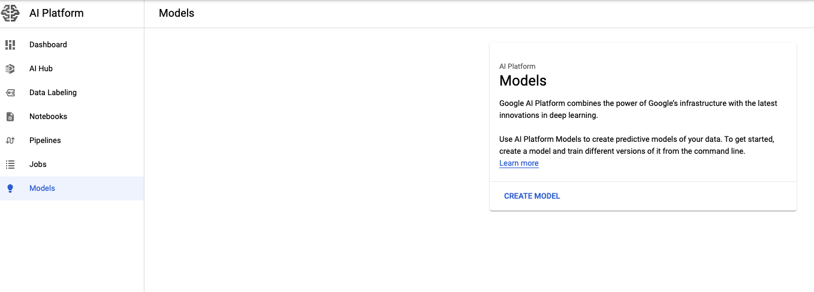

# Google ML tutorials - Deploy a Machine Learning model on Google AI Platform
In the last articles, we [found the best hyperparameters][Tuning article] for our Machine Learning model and then [trained it][Training article].
The following step is to deploy it: we have to create a service that we can query with new data to obtain the prediction from our model.
We will use the [Google AI Platform Prediction service](https://cloud.google.com/ai-platform/prediction/docs) to store our model, version it and create the service to get the predicitons.

For this tutorial, you will need:
- an active Google Cloud Platform account (you can set up a new account visiting
the [homepage](https://cloud.google.com/)) and a GCP *project* 
- [gcloud](https://cloud.google.com/sdk/docs) and
[gsutil](https://cloud.google.com/storage/docs/gsutil_install) installed on your
 workstation
- a trained model that you want to deploy.
  You can create one following the [other tutorials on the series][ML tutorials series], or you can download [this][Example model] as example.

As of now, you can only deploy a **scikit-learn, XGBoost or Tensorflow** model.
I will use the [bank marketing][Training article] scikit-learn pipeline, but the procedure is quite the same for all the frameworks. 


## Step 1: store your trained model on Google Cloud Storage
You have to store the actual model object somewhere in the cloud: a Storage bucket is the right way!

If you don't already have your model on Storage, you can upload it [directly from the browser](https://console.cloud.google.com/storage/browser) or with `gsutil`:

```shell script
gsutil cp local-path/to/model.joblib gs://bank-marketing-model/
```

Keep in mind that the model object must have one of these names:
- `model.joblib` --- created with the `joblib` library
- `model.pkl` --- created with the `pickle` library


## Step 2: test the prediction locally
As for training a model, we can locally test our prediction service before the actual deploy.
For this, we need a json file with the input data to use to query the model.
The format of the file is quite particular, and it goes like this:

```json
[56, "housemaid", "married", "basic.4y", "no", "no", "no", "telephone", "may", "mon", 261, 1, 999, 0, "nonexistent", 1.1, 93.994, -36.4, 4.857, 5191, "no"]
[57, "services", "married", "high.school", "unknown", "no", "no", "telephone", "may", "mon", 149, 1, 999, 0, "nonexistent", 1.1, 93.994, -36.4, 4.857, 5191, "no"]
```

So we have one row for record to predict; each row is a list composed by the values of the model input features, ordered as the original dataset.
Now you can run the local test with this command:

```shell script
gcloud ai-platform local predict \
    --model-dir gs://your-bucket/path-to/model-directory \
    --json-instances ./your-input-file.json \
    --framework scikit-learn
```

- `model-dir` has to be the path to the GCS **directory** containing the `model.joblib` object (not the model itself)
- `framework` is the actual framework used to train the model.
  It can be scikit-learn, tensorflow or xgboost.

Keep in mind that right now we're using our own laptop to run this prediction job, so this job depends on your current Python environment.
To avoid dependencies or version issues, it is better to create an environment using `conda` or `virtualenv` with the same libraries as the [runtime version](https://cloud.google.com/ai-platform/training/docs/runtime-version-list) used to train the model.

## Step 3: deploy the model on AI Platform
If the last step succeded, we can now create a new **model** on the AI Platform!
You can take a look at the [specific section](https://console.cloud.google.com/ai-platform/models) on the Platform, but if this is your first time, it should be empty...



To deploy our pipeline, we have to follow two steps:
- first, we create a **model** instance
- then, a **version** of the above model

A *model instance* is like a container of model *versions*.
The idea is: the use case (like fraud detection on credit cards, cross-selling recommendation or revenue forecast) is the **model**, the actual `joblib` trained with a specific subset of data and with a particular algorithm (Random Forest instead of Logistic Regression) is the **version**. 
In this way, you can keep online multiple versions of the same use case, and even obtain predictions from different ones. 

The first step is quite simple: to create a new model instance, simply run

```shell script
gcloud ai-platform models create your_model_name \
    --region your-region
```

- The *model name* can contain only letters, numbers and underscores (no hyphens!)
- As always, to choose the region a good rule of thumb is to pick the [closest one](https://cloud.google.com/compute/docs/regions-zones) to your current location.

You can check that the model is on with

```shell script
gcloud ai-platform models list \
    --region your-region
```

Now the second step: create the first version of our model.

```shell script
gcloud ai-platform versions create your_version_name \
    --model your_model_name \
    --origin gs://your-bucket/path-to/model-directory \
    --region your_region \
    --framework scikit-learn \
    --python-version 3.7 \
    --runtime-version 2.2 \
    --machine-type n1-standard-4
```

- As for the model name, the *version name* should contain only letters, numbers and underscores
- The `origin` parameter is the same GCS path used in the local testing
- Use the same `python-version` and `runtime-version` specified for your cloud training job. If you did not use a training job to create your model, choose the runtime version with the same package versions you used.
- The [list](https://cloud.google.com/ai-platform/prediction/docs/machine-types-online-prediction) of `machine-type` offered provides a wide range of choices.
  To make the right call, you have to understand if you need a GPU, how big is your model artifact, and how many prediction requests you expect your model will receive.
  I pick one of the simpliest machine types, with 4 nodes.
  
This could take a while, so don't worry if you have to wait a few minutes...
As before, you can check that your version is online with

```shell script
gcloud ai-platform versions list \
    --model your_model_name \
    --region your_region
```


## Step 4: actually use the model!
Now we can finally query our model with new data and receive our well deserved predictions. With the `gcloud` command it's super easy! Just run

```shell script
gcloud ai-platform predict \
    --model your_model_name \
    --version your_version_name \
    --region your_region \
    --json-instances ./your-input-file.json
```

The json input file should have the same structure of the one used for the local training.
For example, using the 2 records above I get

```shell script
[0, 0]
``` 

And that's it!

## Step 5: clear the model
You should not follow this step if your model has to remain online, but for the purpose of learning and testing you should delete both model and version to not incur into unwanted costs (speaking from experience...).

Run both

```shell script
gcloud ai-platform versions delete your_version_name \
  --model your_model_name \
  --region your_region

gcloud ai-platform models delete your_model_name \
  --region your_region
```

Now you can manage the full model creation on Google, from [tuning][Tuning article] to [training][Training article] to deploying! Enjoy!


[ML tutorials series]: https://towardsdatascience.com/tagged/google-ml-tutorials
[Training article]: https://towardsdatascience.com/training-a-model-on-google-ai-platform-84ceff87b5f3
[Tuning article]: https://towardsdatascience.com/tuning-a-model-with-bayesian-optimization-on-google-ai-platform-d9fe63b78576
[Example model]: https://www.google.it