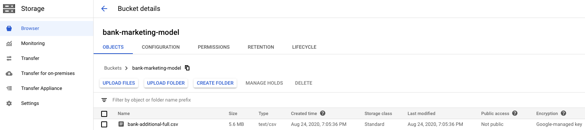
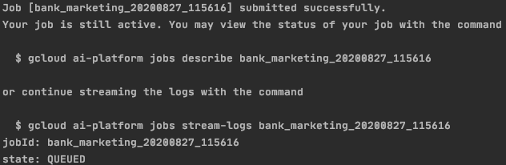
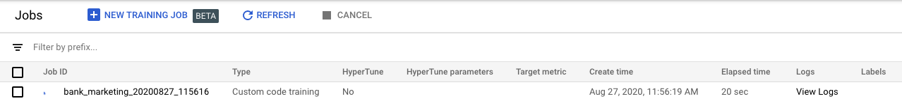
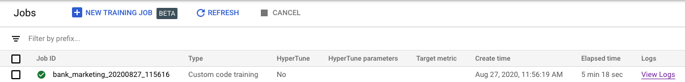
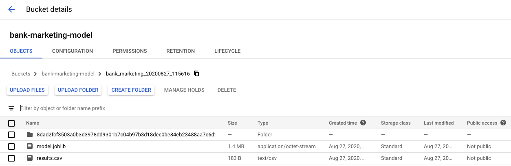

# Google ML tutorials - Training a model on Google AI Platform
Welcome to the first article in this series about doing Machine Learning stuff 
on the Google Cloud Platform!

We will take a look at the [AI Platform](https://cloud.google.com/ai-platform/docs "docs").
It is a subset of tools strictly related to Machine Learning, among which:
- AI Platform Training, for training/tuning models on the cloud
- AI Platform Prediction, to host trained models on the cloud
- AI Pipelines, to create a step-by-step process using Kubernetes and Docker Images

and many others.

*DISCLAIMER: I am not affiliated with Google in any way, I simply decided to
write these articles to share the knowledge I acquired using these tools in my
daily job.*

For this first article, I'll focus on *AI Platform Training*, a product to run
training jobs on the Cloud with custom code and customizable machines. I think 
the main advantages of using the AI Platform to train your models are:
- you can use **more powerful resources** (like multiple cores or a GPU) without a lot of hassle to instantiate them
- you can **share** the code with your team and **reproduce** the same results using a common Cloud infrastructure

In this tutorial, we will write the actual **Python application** with the 
definition of the training, run a **local test**, and execute the **training 
job** on the Cloud Platform.

For the tutorial, you will need:
- an active Google Cloud Platform account (you can set up a new account visiting
the [homepage](https://cloud.google.com/)) and a GCP *project* 
- Python 3, [gcloud](https://cloud.google.com/sdk/docs) and
[gsutil](https://cloud.google.com/storage/docs/gsutil_install) installed on your
 workstation
- the [dataset used for the tutorial](https://archive.ics.uci.edu/ml/machine-learning-databases/00222/bank-additional.zip),
UCI's ***bank marketing dataset***. [Here](https://archive.ics.uci.edu/ml/datasets/Bank+Marketing) 
you can find the documentation about the dataset. We will use the **full** version.

## Step 1: store the data on Google Storage
After you downloaded the dataset on your local machine, go to the [Google Storage console](https://console.cloud.google.com/storage/)
of your GCP project. Create a new bucket (I've called it `bank-marketing-model`) and
load the dataset in it. Now your bucket should look like this:



Alternatively, in a more geeky way, you can use `gsutil` from the
command line. Go into the local directory containing the dataset and run

```shell script
gsutil mb gs://bank-marketing-model
gsutil cp ./bank-additional-full.csv gs://bank-marketing-model
```

- `gsutil mb` creates the bucket
- `gsutil cp` copies a file from the local path to the GCS bucket

## Step 2: write the Python training application
If you're reading this, chances are that you already know how to write an 
end-to-end Python program to train a Machine Learning model. Anyway, since we're
 planning to train the model on the Cloud, there are a few steps that are 
someway different than the usual *Kaggle-ish* code.

The first thing to bear in mind, **you can use only scikit-learn, XGBoost or 
Tensorflow** to train your model (Pytorch is in beta, and there is a way 
to use a custom Python environment, but we'll see it in another article).

So, the basics of the Python application are:
- download the dataset from Storage
```python
subprocess.call([
    'gsutil', 'cp',
    # Storage path
    os.path.join('gs://', STORAGE_BUCKET, DATA_PATH),
    # Local path
    os.path.join(LOCAL_PATH, 'dataset.csv')
])

df = pd.read_csv(os.path.join(LOCAL_PATH, 'dataset.csv'), sep=';')
```
- do some data preparation (split train-test, missing imputation, ...) and create the pipeline
```python
train, test = train_test_split(df, test_size=args.test_size)

...

pipeline = Pipeline([
    # The ColumnTransformer divide the preprocessing process between
    # categorical and numerical data
    ('data_prep',
     ColumnTransformer([
        ('num_prep', StandardScaler(), num_features),
        ('cat_prep', OneHotEncoder(), cat_features)
     ])),
    # ML model
    ('model',
     RandomForestClassifier(
         random_state=1123,
         n_jobs=args.n_jobs,
         n_estimators=args.n_estimators,
         max_depth=args.max_depth,
         max_features=args.max_features if args.max_features is not
                                              None else 'sqrt',
         min_samples_split=args.min_samples_split,
         class_weight='balanced',
         max_samples=args.max_samples
     ))
])
```
- train the model
```python
pipeline.fit(train, y_train)
```
- get some performance metrics
```python
results = pd.DataFrame(
    {'accuracy': [accuracy_score(y_train, pred_train),
                  accuracy_score(y_test, pred_test)],
     'precision': [precision_score(y_train, pred_train, pos_label='yes'),
                   precision_score(y_test, pred_test, pos_label='yes')],
     'recall': [recall_score(y_train, pred_train, pos_label='yes'),
                recall_score(y_test, pred_test, pos_label='yes')],
     'f1': [f1_score(y_train, pred_train, pos_label='yes'),
            f1_score(y_test, pred_test, pos_label='yes')]},
    index=['train', 'test']
)
```
- store the trained model and results on Storage
```python
subprocess.call([
    'gsutil', 'cp',
    # Local path of the model
    os.path.join(LOCAL_PATH, 'model.joblib'),
    os.path.join(args.storage_path, 'model.joblib')
])
subprocess.call([
    'gsutil', 'cp',
    # Local path of results
    os.path.join(LOCAL_PATH, 'results.csv'),
    os.path.join(args.storage_path, 'results.csv')
])
```

You can find the whole code on [Github](https://github.com/MatteoFelici/medium/blob/master/ai-platform-training/src/train.py).
 
*N.B.: at the top of the code there are a few parameters that you can tune.*

## Step 3: test the code locally
Before submitting the training process on the Cloud Platform, it is better to 
test the code locally. For both local and cloud training, we will use `gcloud`; 
the command to run is quite similar, but there are a few differences.

First, to **train the model locally with the AI Platform**, we can write a command 
that "revert" this logic:
`gcloud ai-platform` (with the AI Platform) `local` (locally) `train` (train 
the model). We add a bunch of parameters, some of which are specific to the training
 process, others are defined in our custom Python application.

After you go into the main directory, with the `src` directory, the complete 
command goes like this:
```shell script
gcloud ai-platform local train \
    --module-name=src.train \
    --package-path=./src \
    -- \
    --storage-path=gs://bank-marketing-model/test \
    --n-estimators=25
```

Let's take a look at the parameters:
- `module-name` is the name of the Python module to run, in the form of directory.python_file
- `package-path` is the path to the module directory
- `--` tells that we start sending custom parameters

Since this is a test run, we specify a low number of trees for the Random Forest.

Keep in mind that, even if this is a local test run, it will create all the artifacts and save them to your Storage Bucket. If everything runs without errors, we can switch to the actual training on the Cloud!

## Step 4: train on AI Platform
Now that we have written the application and tested it, we can finally train our model on the Platform. For example, we can instantiate a multi-core machine type and parallelize the training of the Forest. 

As said before, the bash code is quite similar, but we have to invoke another 
group of commands. Instead of `local train` we use `jobs submit training`:

```shell script
gcloud ai-platform jobs submit training $JOB_NAME \
    --module-name=src.train \
    --package-path=./src \
    --staging-bucket=gs://bank-marketing-model \
    --region=$REGION \
    --scale-tier=CUSTOM \
    --master-machine-type=n1-standard-8 \
    --python-version=3.7 \
    --runtime-version=2.1 \
    -- \
    --storage-path=gs://bank-marketing-model/$JOB_NAME \
    --n-estimators=500 \
    --n-jobs=8
``` 

Once again, let's take a look at the new parameters:
- `module-name` and `package-path` are the same as before
- `staging-bucket` points to a Google Storage bucket where to store training artifacts
- `region` is the Google Cloud region ([here](https://cloud.google.com/compute/docs/regions-zones)
 the full list). Since the machines instantiated for these jobs are located all around
  the world, you may want to specify where to instantiate the 
  machine. If you are unsure how to set this parameter, simply set the closest 
  region from where you are!
- `scale-tier` specify which type of machine to use for the training. This is a 
high-level parameter, you can set it to a default configuration (like `BASIC` or
 `STANDARD_1`), or set it to `CUSTOM` and use the `master-machine-type` parameter
  to use a low-level definition of the machine. In our example, we use a 
*standard* machine with **8** cores. We can also specify *highmem* (for more 
memory) or *highcpu* (for more virtual CPU) instead of `standard`. The full list
 of `scale-tier`s and available machines is [here](https://cloud.google.com/ai-platform/training/docs/machine-types#compare-machine-types).
- `python-version` and `runtime-version` parameters specify the backbone of the packages installed on the machine. For each *runtime* ([here](https://cloud.google.com/ai-platform/training/docs/runtime-version-list) the full list) we have one or more Python versions we can use, and a list of Python packages already installed.

```
BONUS TIP: if you want to install a package that is not available in the runtime 
list, add a "pip" command at the top of your application, like

subprocess.call(["pip", "install", name_of_the_package])
```
- For our custom parameters, we set a higher number of estimators and specify to
 run 8 jobs in parallel.


N.B. the `$JOB_NAME` in the code above is not a valid name, but it's a reference 
to a bash variable defined before. It is very important to specify each time a 
different job name. For example, as you can see in the [cloud_train](https://github.com/MatteoFelici/medium/blob/master/ai-platform-training/cloud_train.sh) 
script, we can specify

```
JOB_NAME=bank_marketing_$(date +%Y%m%d_%H%M%S)
```

so the suffix will change every time with the actual day and time.

If it's the first time you use this tool, it will probably ask you to enable a specific Google API (like `ml.googleapis.com`): accept to enable it and continue. If everything is ok, the command should return something like this



and in your [Google AI Platform Jobs console](https://console.cloud.google.com/ai-platform/jobs) you should see the new job running



Now, you can monitor the training job in two ways:
- with the suggested command `gcloud ai-platform jobs stream-logs $JOB_NAME`
- clicking on *View Logs* on the Jobs console



Hooray! The job ended correctly. Let's take a look at our Storage bucket:



We have the `model.joblib` object, the `results.csv` file with the model performance and a folder automatically created by the job to storage the Python application.

Let's take a look at the model performances... We can download the results file, or type the command

```
gsutil cat gs://your-bucket/your/path/to/results.csv
```

to see the file directly on the command line.

For my trained model, I got these results:

| Measure     | Train  | Test   |
| ----------- | ------ | ------ |
| *Accuracy*  | 80.65% | 80.35% |
| *Precision* | 36.35% | 35.18% |
| *Recall*    | 94.03% | 94.13% |
| *F1*        | 52.44% | 51.22% |

These are quite good results, but we can do better by **tuning the 
hyperparameters** of the model. In the next article, we will see how to slightly 
change the training application to make the AI Platform search the best 
hyperparameters with a **Bayesian optimization process**!

Thanks for reading, and I hope you will find this useful!