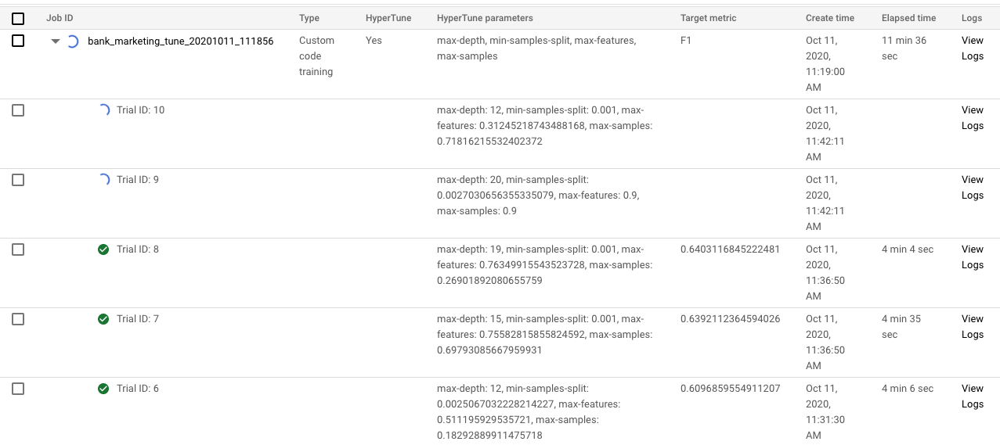
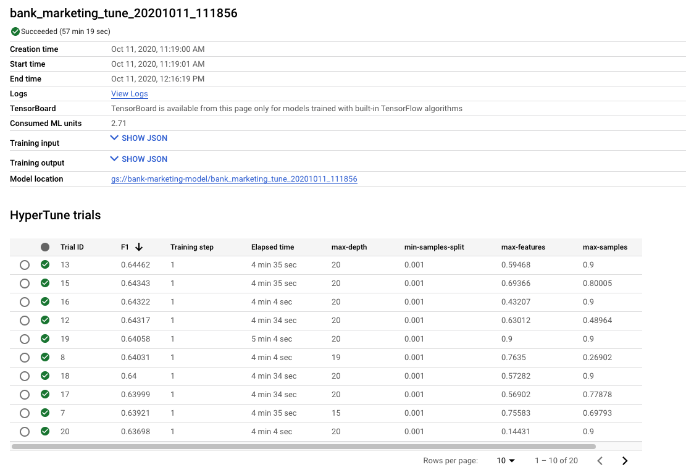

# Google ML tutorials - Tuning a model with Bayesian Optimization on Google AI Platform
In this article of the [Google ML tutorials][ML tutorials series]
series, we will talk about how to use the [AI Platform](https://cloud.google.com/ai-platform)
built-in tool to tune the hyperparameters of your Machine Learning model! We
will use a method called **Bayesian Optimization** to navigate the hyperparameters 
space and then find a set better than the default.

In the last [article][Training article], we trained a `RandomForestClassifier` 
on a [bank marketing dataset](https://archive.ics.uci.edu/ml/datasets/Bank+Marketing). 
We used the default hyperparameters of the algorithm, reaching quite good 
results. But what if I want to tune this model, trying to find a better set of 
hyperparameters? For example, I would like to tune: 
- `max_depth`: the maximum depth of each tree of the forest
- `min_samples_split`: the minimum number (or fraction) of samples to split a 
node of the tree
- `max_features`: the number (or fraction) of input features to use for the 
training of each tree
- `max_samples`: same as `max_features`, but for the rows

The most common ways of searching for the best hyperparameters are the **Grid 
Search** and the **Random Search** methods.

- In the Grid Search, the algorithm trains a model for every single combination 
of the given hyperparameters and then returns the set with the best performance. 
This method is really time-consuming, especially when you want to tune more than 
2-3 hyperparameters at once because the number of models to train grows 
exponentially.
- In the Random Search, the algorithm instead picks at random *n* combinations 
of hyperparameters and train a model for each of them. Here the problem is in 
the *random* word: the algorithm may skip the most effective sets of 
hyperparameters, especially when we set a low *n*.

In this tutorial, we will use the Bayesian Optimization method with a little 
help from Google AI Platform! But first, what is Bayesian Optimization?

Even if on this article we will focus more on the code part than on the theory behind 
the method, I'll try to give a quick overview. For a more robust and complete 
introduction, I suggest taking a look at these articles ([1](https://towardsdatascience.com/a-conceptual-explanation-of-bayesian-model-based-hyperparameter-optimization-for-machine-learning-b8172278050f)
and [2](https://cloud.google.com/blog/products/gcp/hyperparameter-tuning-cloud-machine-learning-engine-using-bayesian-optimization)).

In a certain way, the Bayesian Optimization takes the good from both above 
methods: it does pick a subsample of all the possible combinations of 
hyperparameters, but the picking is done in a more informed way. The algorithm 
models the distribution of the objective function (say the average precision of 
our model) with a surrogate function; the domain of this function is the given 
hyperparameters space. It then explores this distribution trying different 
sets of hyperparameters. At each trial, it gains more information (in Bayes 
fashion) about the real distribution of the objective function, so it can move 
to a more "promising" subset of the domain space.

For this specific reason, keep in mind that we cannot fully parallelize the 
process of the Bayesian Optimization (as opposed to Grid and Random Search), 
since each iteration learns from the previous one.

Now let's train some models! For the tutorial, we will follow the same steps of 
the [training tutorial][Training article]:
- store the data on Google Storage
- write a Python application to train the model
- launch a training job on AI Platform

The big differences are on the Python application itself: we need to add a
framework to chain the model's performance results to the Bayesian Optimization. 
This framework is called [Hypertune](https://github.com/GoogleCloudPlatform/cloudml-hypertune): 
you can install it simply with `pip install cloudml-hypertune`.

## Changing the Python application
The first thing to do is to define the list of hyperparameters we want to tune. 
We have to train a pipeline like this

```python
pipeline = Pipeline([
    ('data_prep',
     ColumnTransformer([
        ('num_prep', StandardScaler(), num_features),
        ('cat_prep', OneHotEncoder(handle_unknown='ignore'), cat_features)
     ])),
    # ML model
    ('model',
     RandomForestClassifier(
         random_state=42,
         n_estimators=500,
         class_weight='balanced'
     ))
])
```
 
To pass these hyperparameters to the application (and to the pipeline), we have to define a list of arguments with the `argparse` library, like this

```python
import argparse

...

# Instantiate an argument parser
parser = argparse.ArgumentParser()

# Define the list of input arguments
parser.add_argument('--max-depth', type=int, default=10,
                    help='Maximum depth of each tree in Random Forest model'
                         ' (integer, default 10)')
```

Then we parse the arguments and input them in the pipeline

```python
# Parse arguments
args = parser.parse_args()

...

pipeline = Pipeline([
    ('data_prep',
     ColumnTransformer([
        ('num_prep', StandardScaler(), num_features),
        ('cat_prep', OneHotEncoder(handle_unknown='ignore'), cat_features)
     ])),
    # ML model
    ('model',
     RandomForestClassifier(
         random_state=42,
         n_jobs=args.n_jobs,
         n_estimators=args.n_estimators,
         max_depth=args.max_depth,
         max_features=args.max_features,
         min_samples_split=args.min_samples_split,
         class_weight='balanced',
         max_samples=args.max_samples
     ))
])
```

After that, we need a strategy to assess the performance for each set of given 
hyperparameters. 
We use the **cross-validation** methodology:
1. you divide your data into *n* splits
2. choose one split as *validation*
3. concatenate the remaining *n-1* splits and train the model on this new 
dataset
4. calculate the performance on the hold-out split
5. repeat 2-4 on each split

This method is suitable if you want to robustly assess a model, because you 
train and validate it on *n* potentially different scenarios.

We can use the pre-built `cross_validate` [function](https://scikit-learn.org/stable/modules/generated/sklearn.model_selection.cross_validate.html#sklearn.model_selection.cross_validate) 
from scikit-learn.

```python
from sklearn.model_selection import cross_validate

...

scores = cross_validate(pipeline, train, y_train,
                        scoring=['accuracy', 'precision', 'recall', 'f1'],
                        cv=5)
```

We provide:
- a valid classifier (we can use a model like `GradientBoostingClassifier`, or 
a whole pipeline like in our case)
- input data and target
- one or more metrics to calculate (like accuracy and precision) - [here](https://scikit-learn.org/stable/modules/model_evaluation.html#scoring-parameter)
 the full list of available metrics
- a value for *n* (the `cv` parameter)

The `scores` result is a dictionary with an entry for each given metric. For example, 
`scores['test_accuracy']` will be a vector with the 5 calculated accuracies on the 5 iterations.

Finally, we have to use the `hyperopt` framework. Since the whole optimization is 
based on a single value, we have to choose one particular metric (*F1-score*) and 
compute the average value.

```python
# Instantiate a hypertune object
hpt = hypertune.HyperTune()

# Compute the average metric
avg_f1 = scores['test_f1'].mean()

# Pass the value to hyperopt
hpt.report_hyperparameter_tuning_metric(
    hyperparameter_metric_tag='F1',
    metric_value=avg_f1,
    global_step=1
)
``` 

And that's it for the Python application! You can find the whole application on my [Github repo](https://github.com/MatteoFelici/medium/blob/master/ai-platform-tuning/src/tune.py).

But hey! We have defined the hyperparameters to tune, but not which values (or 
range of values) the application has to try with the Bayesian Optimization. How 
can we do this?


## Specify hyperparameters - The *config* file
We create a new configuration file with the list of hyperparameters to tune. For each of them we specify:
- the type, like categorical or integer
- if categorical, the categories it can take as value
- if numerical, the range of numbers AND the type of scaling to apply

For example, for the **max depth** hyperparameter we specify:
- integer type
- values between 4 and 20
- linear scale, so the space of possible values is linearly scaled to (0, 1)

For **min samples split**, instead, we could specify:
- float (double) type
- values between 0.001 and 0.1
- since we want to take the leftmost values more often than the rightmost, we 
use a *logarithmic* scale

All these definitions go into a `config.yaml` file:

```yaml
trainingInput:
  hyperparameters:
    goal: MAXIMIZE
    hyperparameterMetricTag: F1
    maxTrials: 20
    maxParallelTrials: 2
    params:
    - parameterName: max-depth
      type: INTEGER
      minValue: 4
      maxValue: 20
      scaleType: UNIT_LINEAR_SCALE
    - parameterName: min-samples-split
      type: DOUBLE
      minValue: 0.001
      maxValue: 0.1
      scaleType: UNIT_LOG_SCALE
    - parameterName: max-features
      type: DOUBLE
      minValue: 0.1
      maxValue: 0.9
      scaleType: UNIT_LINEAR_SCALE
    - parameterName: max-samples
      type: DOUBLE
      minValue: 0.1
      maxValue: 0.9
      scaleType: UNIT_LINEAR_SCALE
```

Let's take a look at this file.
- At the top, we identify which is the `goal` of the tuning job. We want to 
`MAXIMIZE` a metric with the tag `F1`. Keep in mind that this tag should be the 
same given to the `hpt.report_hyperparameter_tuning_metric` in the Python app.
- Then, we define the trials (rounds) that the tuning job has to take. We say 
"20 trials in total, 2 parallel at each time". There is a tradeoff between 
time and performance: the more parallel jobs we specify, the less time it takes. 
But keep in mind that the Bayesian process learns from previous steps: the 
learning steps are `total trials / number of parallel trials` (in our case, 10), 
so if we parallelize "too much" the process will have few steps to learn.
- Finally, we list the hyperparameters, one by one, with the abovementioned 
features. Again, keep in mind that the `parameterName` has to be the same 
defined in the `argparse` section of the Python application. [Here](https://cloud.google.com/ai-platform/training/docs/reference/rest/v1/projects.jobs#ParameterSpec)
you can find the whole documentation for the hyperparameter definition.


## Run the tuning job on the AI Platform
We will use the same command applied for [training][Training article], adding 
the specification of the `config` file:

```shell script
gcloud ai-platform jobs submit training "$JOB_NAME" \
    --module-name=src.tune \
    --package-path=./src \
    --job-dir=gs://bank-marketing-model/"$JOB_NAME" \
    --region=$REGION \
    --scale-tier=CUSTOM \
    --master-machine-type=n1-standard-8 \
    --python-version=3.7 \
    --runtime-version=2.2 \
    --config=./config.yaml \
    -- \
    --n-jobs=8
```

When you submit the code, a new entry will appear into your [Google AI Platform Jobs console](https://console.cloud.google.com/ai-platform/jobs):



You can pop this entry and see each of the 20 trials: some will be finished, 
others will be running. For each trial, there is the list of hyperparameters 
chosen and the final value of the F1 metric.

When all the trials are done, if we click on the "mother" job we will see a 
summary of the trials results, ordered from the best to the worst. 



In this example, we can see that the **max-depth** and the **min-samples-split** 
hyperparameters are quite settled, with the best performing value of 20 and 0.001 
respectively. The other two hyperparameters are not fixed yet, but we can see a 
trend towards the higher half of the interval.

To prove the fact that the process has learned in time, we calculate the 
correlation between the number of the trial and the "arrival" order. We spot a 
-0.71 correlation! This means that a higher trial number (so a trial with more 
"learning" process) has a lower arrival spot.

When we [trained](Training article) the same model on the same data but with 
default hyperparameters, we reached a 52.44% F1 on train and a 51.22% F1 on 
test. Now, with cross-validation + Bayesian Optimization, we reached 64.46%! The 
next steps could be:
- run another tune job, fixing max-depth and min-samples-split and focusing on 
the other hyperparameters
- tune other hyperparameters, like `criterion` or `min_impurity_split`
- run a training job, using the best found set of hyperparameters, to have a 
model to deploy

Thanks again for reading this article! I really hope you can manage to use this 
powerful tool to enhance your Machine Learning models. Please leave a comment 
with your experience or feedback!
   

[ML tutorials series]: https://towardsdatascience.com/tagged/google-ml-tutorials
[Training article]: https://towardsdatascience.com/training-a-model-on-google-ai-platform-84ceff87b5f3