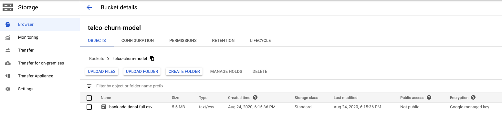

# Google AI Platform adventures - Training
Welcome to the first articles in this series about doing Machine Learning stuff 
on the Google Cloud Platform!

In particular, we will take a look at the [AI Platform](https://cloud.google.com/ai-platform/docs "docs").
It is a subset of tools strictly related with Machine Learning, among which:
- AI Platform Training, for training/tuning models on the cloud
- AI Platform Prediction, to host trained models on the cloud
- AI Pipelines, to create a step-by-step process using Kubernetes and Docker Images

and many others.

*DISCLAIMER: I am not affiliated with Google in any way, I simply decided to
write these articles to share the knowledge I acquired using these tools in my
daily job.*

For this first article, I'll focus on *AI Platform Training*, a product to run
training jobs on the Cloud with custom code and customizable machines.

In this tutorial we will see how to train an end-to-end Machine Learning model
by:
- writing the actual Python application with the definition of the training
- run a local test
- run the training job on the Cloud Platform

For the tutorial, you will need:
- an active Google Cloud Platform account (you can setup a new account visiting
the [homepage](https://cloud.google.com/)) and a GCP project 
- Python3
- [gcloud](https://cloud.google.com/sdk/docs) and
[gsutil](https://cloud.google.com/storage/docs/gsutil_install) installed on your
 workstation
- the [dataset used for tutorial](https://archive.ics.uci.edu/ml/machine-learning-databases/00222/bank-additional.zip),
UCI's *bank marketing dataset*. [Here](https://archive.ics.uci.edu/ml/datasets/Bank+Marketing) 
you can find the documentation about the dataset. We will use the *full* version.

## Step 1: store the data on Google Storage
After you downloaded the dataset on your local machine, go to the Google Storage
of your GCP project. Create a new bucket (I'll call it `telco-churn-model`) and
load the dataset in it. The situation should look like this:



If you want the more geeky way, you can use the `gsutil` application from the
command line. Then, from the command line, go into the local directory
containing the dataset and

```
# Create the bucket
gsutil mb gs://bank-marketing-model
# Upload the file
gsutil cp bank-additional-full.csv gs://bank-marketing-model
```

## Step 2: write the Python training application
If you're reading this, chances are that you already know how to write an 
end-to-end Python program to train a Machine Learning model. Anyway, since we're
 planning to train the model on the Cloud, there are a few steps that are 
someway different than the usual __Kaggle-ish__ code.

First thing to bare in mind, **you can use only scikit-learn, XGBoost or 
Tensorflow** to train your model in the "classic" Training job (there is a way 
to use a custom Python environment, but we'll see it in another article).

So, the basics of the Python application are:
- download the dataset from Storage
```python
subprocess.call([
    'gsutil', 'cp',
    # Storage path
    os.path.join('gs://', STORAGE_BUCKET, DATA_PATH),
    # Local path
    os.path.join(LOCAL_PATH, 'dataset.csv')
])

df = pd.read_csv(os.path.join(LOCAL_PATH, 'dataset.csv'), sep=';')
```
- do some data preparation (split train-test, missing imputation, ...)
```python
train, test = train_test_split(df, test_size=args.test_size)

...

pipeline = Pipeline([
    # The ColumnTransformer divide the preprocessing process between
    # categorical and numerical data
    ('data_prep',
     ColumnTransformer([
        ('num_prep', StandardScaler(), num_features),
        ('cat_prep', OneHotEncoder(), cat_features)
     ])),
    # ML model
    ('model',
     RandomForestClassifier(
         random_state=1123,
         n_estimators=args.n_estimators,
         max_depth=args.max_depth,
         min_samples_split=args.min_samples_split,
         max_features=args.max_features if args.max_features is not
                                              None else 'sqrt',
         max_samples=args.max_samples
     ))
])
```
- train the model
```python
pipeline.fit(train, y_train)
```
- get some performance metrics
```python
results = pd.DataFrame(
    {'accuracy': [accuracy_score(y_train, pred_train),
                  accuracy_score(y_test, pred_test)],
     'precision': [precision_score(y_train, pred_train, pos_label='yes'),
                   precision_score(y_test, pred_test, pos_label='yes')],
     'recall': [recall_score(y_train, pred_train, pos_label='yes'),
                recall_score(y_test, pred_test, pos_label='yes')],
     'f1': [f1_score(y_train, pred_train, pos_label='yes'),
            f1_score(y_test, pred_test, pos_label='yes')]},
    index=['train', 'test']
)
```
- store the trained model and results on Storage
```python
subprocess.call([
    'gsutil', 'cp',
    # Local path of the model
    os.path.join(LOCAL_PATH, 'model.joblib'),
    os.path.join(args.storage_path, 'model.joblib')
])
subprocess.call([
    'gsutil', 'cp',
    # Local path of results
    os.path.join(LOCAL_PATH, 'results.csv'),
    os.path.join(args.storage_path, 'results.csv')
])
```

You can find the whole code on [Github]().

### Step 3: test the code locally
Before submitting the training process on the Cloud Platform, it is better to test the code locally. For both local and cloud training, we will use `gcloud`; the command is quite similar, but there are a few differences.

First, to train the model locally with the AI Platform, we can write a command that "revert" this logic:
`gcloud ai-platform` (with the AI Platform) `local` (locally) `train` (train ther model), and then we add a bunch of parameters, some specific of the training process, others defined in our custom Python application. 

After you go into the main directory, with the `/src` directory, the complete command goes like this:
```shell script
gcloud ai-platform local train \
    --module-name=src.train \
    --package-path=./src \
    -- \
    --storage-path=gs://bank-marketing-model/test \
    --n-estimators=25
```

Let's take a look at the parameters:
- `module-name` is the name of the module to run, in the form of directory.python_file
- `package-path` is the path to the module directory
- `--` tells that we start sending custom parameters
